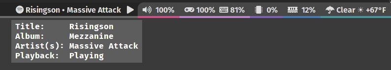

# Untitled Spotifyd Controller
A simple Go utility to display track information from, and send commands to, [spotifyd](https://github.com/Spotifyd/spotifyd) from Tiling Window Managers like Sway and i3



```
Usage of spdcon:
  -c string
        Commands: 'PlayPause', 'Stop', 'Next', 'Previous'
  -o string
        Formatting for output: 'Waybar', 'None' (default)
```

Example Configuration for Waybar:
```json
"custom/spotifyd": {
    "format": " {}  ",
    "return-type": "json",
    "exec": "spdcon -o waybar",
    "on-click": "spdcon -c PlayPause",
    "on-click-right": "spdcon -c Next",
    "on-click-middle": "spdcon -c Previous",
    "interval": 2
}
```
